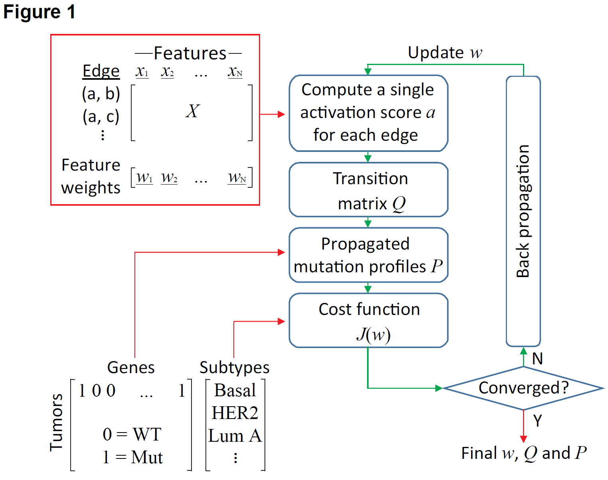
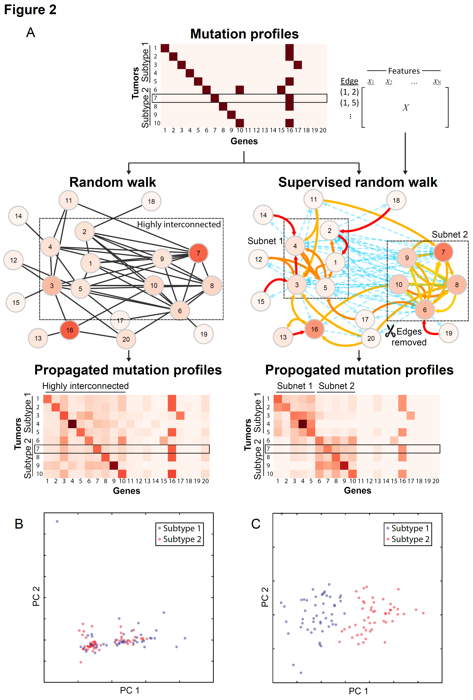
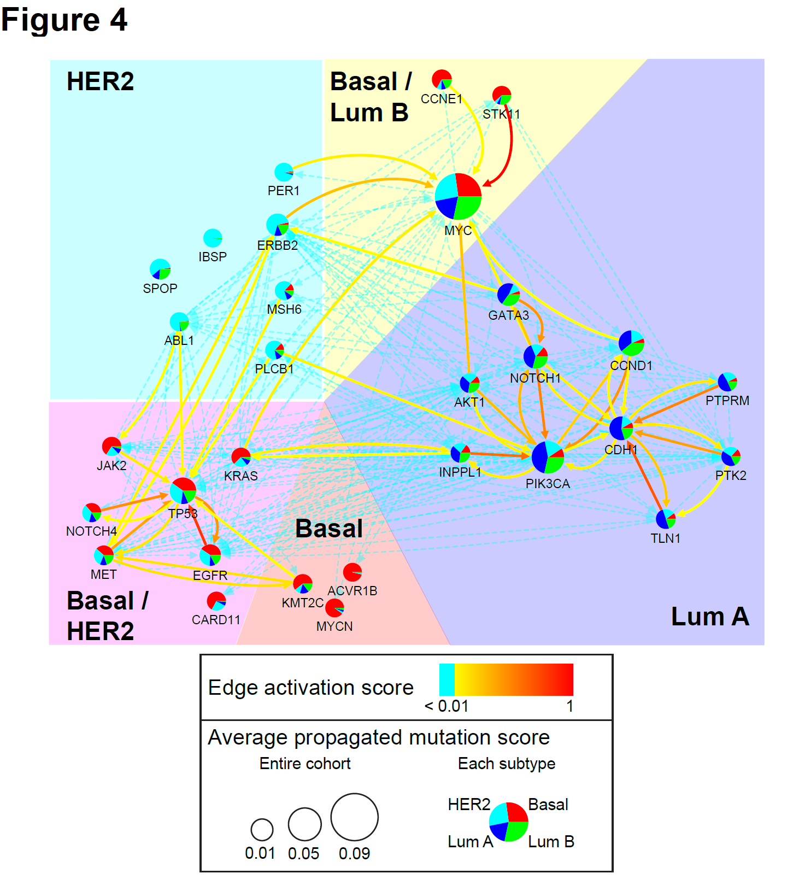

# Classifying tumors by supervised network propagation  
(see [paper](https://academic.oup.com/bioinformatics/article/34/13/i484/5045745))  
  
## Abstract
  
__Motivation:__ Network propagation has been widely used to aggregate and amplify the effects of tumor mutations using knowledge of molecular interaction networks. However, propagating mutations through interactions irrelevant to cancer leads to erosion of pathway signals and complicates the identification of cancer subtypes.  
  
__Methods:__ To address this problem we introduce a propagation algorithm, Network-Based Supervised Stratification (NBS2), which learns the mutated subnetworks underlying tumor subtypes using a supervised approach. Given an annotated molecular network and reference tumor mutation profiles for which subtypes have been predefined, NBS2 is trained by adjusting the weights on interaction features such that network propagation best recovers the provided subtypes. After training, weights are fixed such that mutation profiles of new tumors can be accurately classified.  
  
__Results:__ We evaluate NBS2 on breast and glioblastoma tumors, demonstrating that it outperforms the best network-based approaches in classifying tumors to known subtypes for these diseases. By interpreting the interaction weights, we highlight characteristic molecular pathways driving selected subtypes.  
    
## The package
  
* [__SRW_v044__](./SRW_v044.py) This software package contains all the functions of NBS2.  
  
## Analysis scripts
  
* [__simulation_100x1000__](./simulation_100x1000.ipynb) Script to perform the simulation (**Fig. 2**).  
  
* [__data_processing_BRCA__](./data_processing_BRCA.ipynb) Script to processes PathwayCommons interaction features and Breast Cancer mutation profiles.  
  
* [__SRW_cookbook_BRCA__](./SRW_cookbook_BRCA.ipynb) Run the NBS2 package to classify breast cancer subtypes.   
  
## Equations
  
* [__equations_v044__](./equations_v044.ipynb) This document contains equations of the algorithm.  
  
## Figures
  
| | |
|:---|:---|
|  |  |
| **Fig. 1. NBS2 workflow.** NBS2 takes three input data sets, represented by red arrows: 1) a molecular network where each edge is annotated by a set of features *x*, and each feature is assigned a initial weight *w*; 2) a tumor-by-gene matrix *P*(0) representing the mutation profile of a cohort; and 3) the defined subtype of each tumor. In each iteration, NBS2 compute an activation score a for each edge (**Eq. 3**), calculate a transition matrix *Q* (**Eq. 2**), perform a random walk (**Eq. 1**), and compute the value of the cost function *J*(*w*) (**Eq. 4**). Training the classifier is conducted iteratively using gradient descent. To minimize *J*(*w*), the algorithm calculates the partial derivative of *J*(*w*) with respect to the edge feature weights *w* using the chain rule (**Eqs. 7-11**), and updates *w* accordingly. Upon convergence, the algorithm outputs the final feature weights *w*, transition matrix *Q* and propagated mutation profiles *P*, which together defines the classification model. | **Fig. 2. Experiments on simulated data.** (**A**) Simulated mutation dataset including characteristic genes of two subtypes (gene 1-10) and an Frequently Mutated Gene (FMG) (gene 16). Mutated genes are shown in dark red and non-mutated genes are shown in white. A reduced set of tumors and genes (10 x 20) is shown as an example; the full simulation is (100 ✕ 1000). An edge-by-feature matrix is also used as a input for the supervised random walk. (**B**) Unsupervised and (**C**) supervised random walk of mutations over a simulated gene interaction network. Shades of red show propagated mutation values for tumor sample #7. (**D, E**) Propagated mutation profiles following (**D**) unsupervised and (**E**) supervised random walk. (**F, G**) Principal components analysis (PCA) of the full simulation (100✕1000) between (**F**) unsupervised random walk-based tumor stratification and (**G**) supervised random walk-based tumor classification. |  
|  |  |
| **Fig. 3. Performance of breast cancer subtypes classification.** Values of cost function (left y-axis) and classification accuracy (right y-axis) are plotted against the number of iterations of NBS2 on the (**A**) training data and (**B**) validation data. Dash line indicates the accuracy of tumor stratification based on unsupervised random walk and non-propagated mutation profiles on the validation data. | **Fig. 4. Subnetworks of breast cancer subtypes.** Subnetworks characterizing breast cancer subtypes extracted from Pathway Commons by NBS2, defined as a set of genes with significantly different network-transformed scores between different subtypes (ANOVA FDR < 0.05) and their molecular interactions with higher than average activation scores (> 0.01) learned from NBS2. The pie chart represents the relative proportions of the average propagated mutation score for the four subtypes. For example, the large light blue pie slice on *ERBB2* represents that its average propagation score is much higher in HER2 tumors than other subtypes.|  
  
