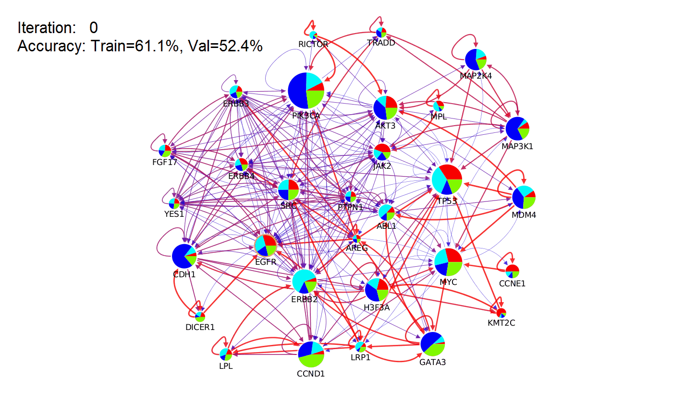

# Supervised Random Walk  
  
  
**The following animation illustrates how Supervised Random Walk works**  
  
  
  
**[This document](./equations_v044.ipynb) contains equations in Supervised Random Walk**  
  
  
[SRW_v044.py](./SRW_v044.py) contains the functions for Supervised Random Walk  
[test.ipynb](./test.ipynb) contains two toy examples for testing the partial derivatives and the gradient descent functions  
[data_processing.ipynb](./data_processing.ipynb) contains the code for processing PathwayCommons edge features and Breast Cancer mutation data  
[SRW_cookbook_BRCA.ipynb](./SRW_cookbook_BRCA.ipynb) contains some example code for classifying Breast Cancer samples into four known subtypes   

